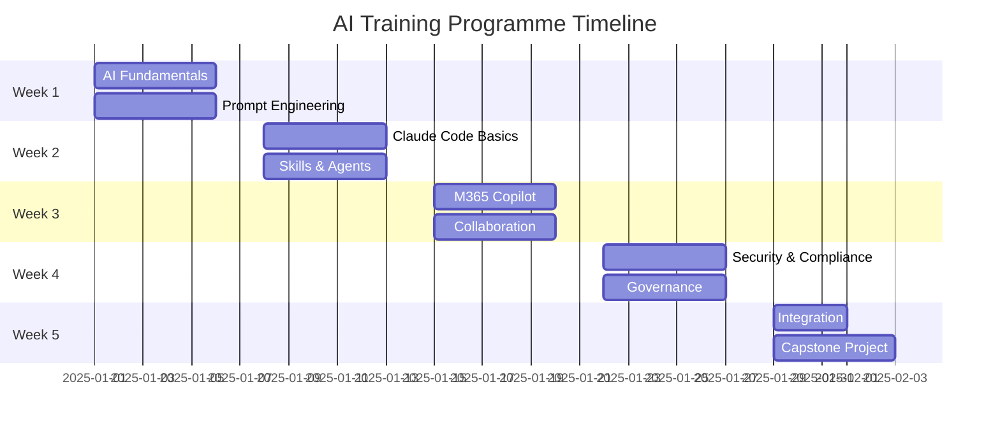
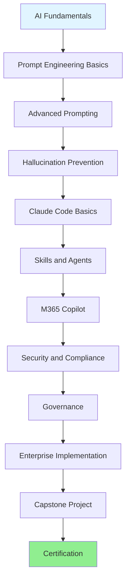
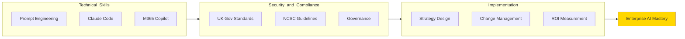
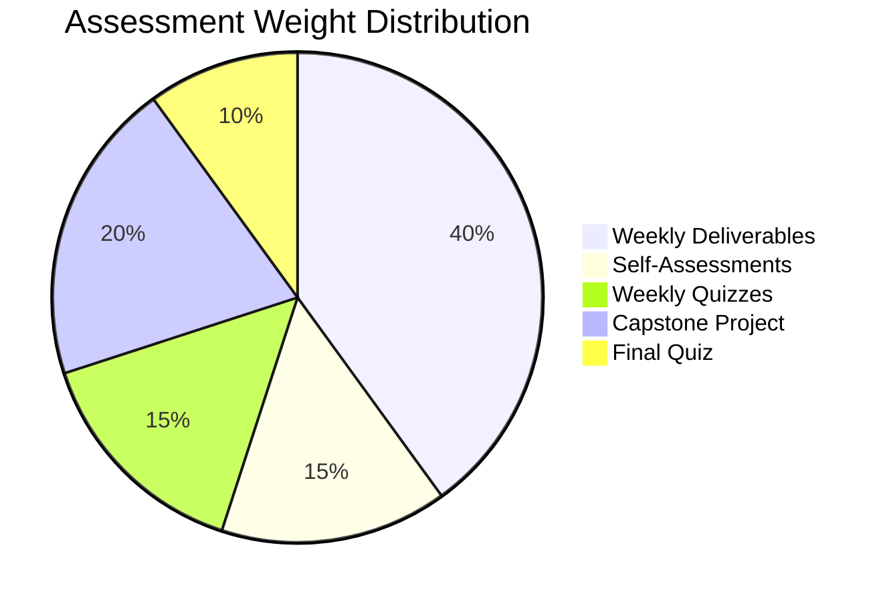
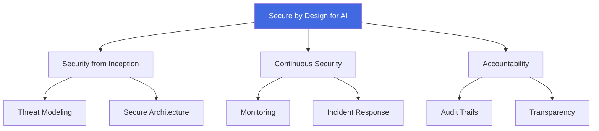
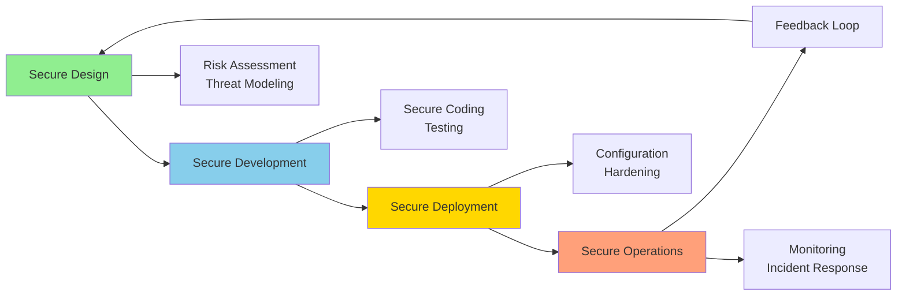
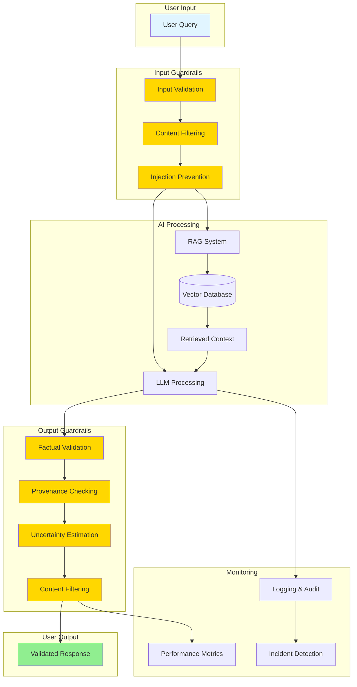
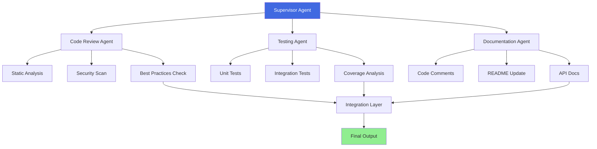
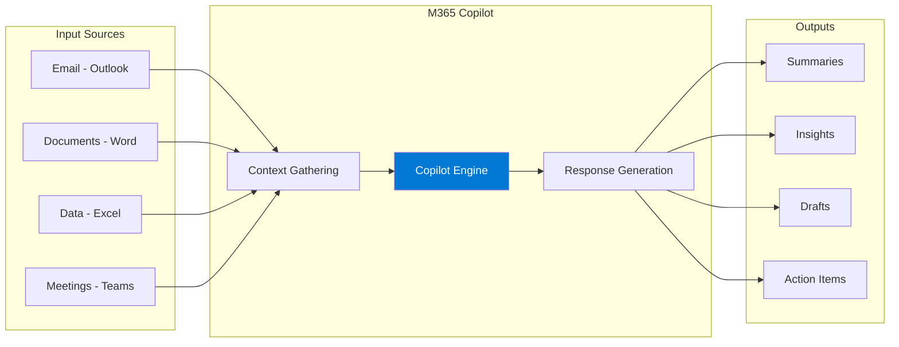
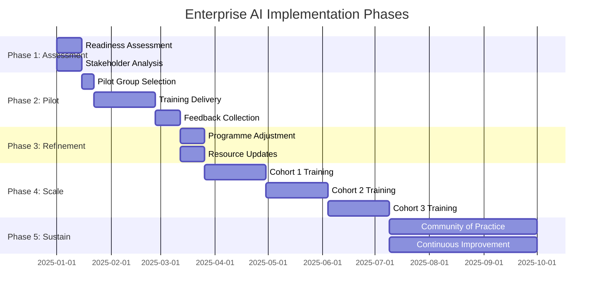

# AI Training Documentation Programme (AITRG)
## Enterprise-Grade AI Training for the Modern Workforce

[]()
[]()
[]()
[]()

---

## Table of Contents

1. [Overview](#overview)
2. [Programme Structure](#programme-structure)
3. [Quick Start Guide](#quick-start-guide)
4. [Learning Path](#learning-path)
5. [Resources](#resources)
6. [Assessment](#assessment)
7. [Compliance Framework](#compliance-framework)
8. [Architecture Diagrams](#architecture-diagrams)
9. [Configuration Examples](#configuration-examples)
10. [Deliverables](#deliverables)
11. [Success Metrics](#success-metrics)
12. [Support](#support)
13. [FAQs](#faqs)
14. [Contribution](#contribution)
15. [License](#license)

---

## Overview

The **Artificial Intelligence Training Documentation (AITRG) Programme** is a comprehensive, self-study training package designed to equip professionals with practical AI skills while ensuring compliance with UK Government Secure by Design principles and NCSC Secure Design guidelines.

### What You'll Learn

- ✅ **Advanced Prompt Engineering** - Master techniques from basic to advanced
- ✅ **Claude Code Mastery** - Build production-ready applications with agentic coding
- ✅ **Microsoft 365 Copilot** - Optimize productivity across all M365 applications
- ✅ **AI Security & Compliance** - Implement UK Gov and NCSC standards
- ✅ **Hallucination Prevention** - Design guardrails and validation systems
- ✅ **Enterprise Implementation** - Create organizational AI strategies

### Programme Statistics

| Metric | Value |
|--------|-------|
| **Total Duration** | 187.5 hours (5 weeks × 37.5 hours/week) |
| **Modules** | 5 major sections, 24 sub-modules |
| **Resources** | 53+ free, verified resources |
| **Assessment Questions** | 100+ quiz questions + self-assessment |
| **Practical Projects** | 15+ hands-on deliverables + capstone |
| **Cost** | £0 (100% free resources) |
| **Registration Required** | None |

---

## Programme Structure

### Week-by-Week Breakdown



### Learning Modules

**Week 1: Foundations** (37.5 hours)
- Module 1.1: Introduction to AI and LLMs (4h)
- Module 1.2: Fundamentals of Prompt Engineering (6h)
- Module 1.3: Advanced Prompt Engineering (5h)
- Module 1.4: Hallucination Prevention & Guardrails (7.5h)
- Module 1.5: Review and Practice (15h)

**Week 2: Claude Code** (37.5 hours)
- Module 2.1: Introduction to Claude Code (5h)
- Module 2.2: Common Workflows (6h)
- Module 2.3: Skills and Artifacts (7h)
- Module 2.4: Agents and Sub-agents (6h)
- Module 2.5: CLAUDE.md Configuration (3.5h)
- Module 2.6: Review and Practice (10h)

**Week 3: M365 Copilot** (37.5 hours)
- Module 3.1: Introduction to M365 Copilot (4h)
- Module 3.2: Productivity Apps (8h)
- Module 3.3: Teams & Collaboration (4h)
- Module 3.4: Advanced Techniques (5h)
- Module 3.5: Review and Practice (16.5h)

**Week 4: Security & Compliance** (37.5 hours)
- Module 4.1: UK Gov Secure by Design (6h)
- Module 4.2: NCSC Secure Design Principles (7h)
- Module 4.3: AI Governance (5h)
- Module 4.4: Privacy & Ethics (4.5h)
- Module 4.5: Monitoring & Incident Response (3h)
- Module 4.6: Review and Integration (12h)

**Week 5: Integration** (37.5 hours)
- Module 5.1: Enterprise Implementation Strategy (8h)
- Module 5.2: Capstone Project (20h)
- Module 5.3: Final Assessment (9.5h)

---

## Quick Start Guide

### Prerequisites

**Technical Requirements:**
- Computer with internet access
- Modern web browser
- Node.js installed (for Claude Code)
- Microsoft 365 subscription (for Copilot modules)

**Knowledge Prerequisites:**
- Basic understanding of software development (for Claude Code modules)
- Familiarity with Microsoft Office applications
- No prior AI experience required

### Getting Started (5 Steps)

**Step 1: Review Programme Materials**
```bash
# Read all documentation files in order:
1. README.md (this file)
2. aitrg_Overview.md
3. syllabus.md
4. resources.md
5. lesson.md
```

**Step 2: Set Up Your Learning Environment**
```bash
# Install Claude Code
npm install -g @anthropic-ai/claude-code

# Verify installation
claude --version

# Set up API key (follow official documentation)
# https://docs.anthropic.com/en/docs/claude-code/overview
```

**Step 3: Create Your Study Schedule**

Use the provided YAML template (see [Configuration Examples](#configuration-examples))

**Step 4: Begin Week 1**

Start with syllabus.md → Module 1.1 → Follow lesson.md for detailed guidance

**Step 5: Track Progress**

- Complete weekly deliverables
- Take self-assessments
- Document learnings in personal notes

---

## Learning Path

### AI Skills Progression



### Competency Development



---

## Resources

### Resource Categories

All resources are **100% free** and require **no registration**.

**Official Documentation:**
- [Claude Code Docs](https://docs.anthropic.com/en/docs/claude-code/overview)
- [Microsoft Learn - Copilot](https://learn.microsoft.com/en-us/copilot/)
- [UK Government AI Playbook](https://www.gov.uk/government/publications/ai-playbook-for-the-uk-government)
- [NCSC AI Guidelines](https://www.ncsc.gov.uk/collection/guidelines-secure-ai-system-development)

**Learning Platforms:**
- [Prompt Engineering Guide](https://www.promptingguide.ai/)
- [Learn Prompting](https://learnprompting.org/)
- [IBM Prompt Engineering Guide](https://www.ibm.com/think/prompt-engineering)

**Video Content:**
- [Anthropic AI YouTube](https://www.youtube.com/@anthropic-ai)
- [Net Ninja](https://www.youtube.com/@NetNinja)
- [Network Chuck](https://www.youtube.com/@NetworkChuck)
- [TechWorld with Nana](https://www.youtube.com/@TechWorldwithNana)

**Complete Resource List:**
See [resources.md](resources.md) for all 53+ curated resources.

---

## Assessment

### Assessment Framework



### Assessment Components

| Component | Weight | Description | Passing Score |
|-----------|--------|-------------|---------------|
| Weekly Module Deliverables | 40% | Hands-on practical exercises | 70%+ |
| Self-Assessment Questionnaires | 15% | Competency self-rating | Complete |
| Weekly Quizzes | 15% | Knowledge checks | 70%+ |
| Capstone Project | 20% | Integrated real-world project | 70%+ |
| Final Comprehensive Quiz | 10% | 100 questions across all modules | 70%+ |

### Assessment Files

- **[selfassessment.md](selfassessment.md)** - Detailed competency self-assessment questionnaire
- **[quiz.md](quiz.md)** - 100-question comprehensive quiz with answers

---

## Compliance Framework

### UK Government Secure by Design



### NCSC AI Development Lifecycle



### Compliance Checklist

✅ UK Government AI Playbook - 10 Principles
✅ UK AI Cyber Security Standard - 13 Principles
✅ NCSC Secure Design Guidelines - 4 Lifecycle Phases
✅ GDPR Data Privacy Requirements
✅ Ethical AI Frameworks
✅ Continuous Monitoring and Incident Response

---

## Architecture Diagrams

### AI System Architecture with Guardrails



### Claude Code Multi-Agent System



### M365 Copilot Workflow Integration



### Enterprise AI Implementation Roadmap



---

## Configuration Examples

### Study Schedule Configuration (YAML)

```yaml
# study_schedule.yaml
# Personalized AI Training Study Schedule

programme:
  name: "AI Training Documentation Programme"
  version: "1.0"
  start_date: "2025-01-06"
  mode: "full-time"  # Options: full-time, part-time
  hours_per_week: 37.5

participant:
  name: "Your Name"
  role: "Software Developer"
  organization: "Your Organization"
  goals:
    - "Master Claude Code for daily development work"
    - "Improve productivity with M365 Copilot"
    - "Ensure AI security compliance"

schedule:
  week_1:
    title: "Foundations of AI and Prompt Engineering"
    start_date: "2025-01-06"
    hours: 37.5
    modules:
      - id: "1.1"
        title: "Introduction to AI and LLMs"
        duration_hours: 4
        day: "Monday"
        time_slot: "09:00-13:00"
        deliverable: "500-word summary"

      - id: "1.2"
        title: "Fundamentals of Prompt Engineering"
        duration_hours: 6
        day: "Monday-Tuesday"
        time_slot: "14:00-17:00, 09:00-12:00"
        deliverable: "10 example prompts"

      - id: "1.3"
        title: "Advanced Prompt Engineering"
        duration_hours: 5
        day: "Tuesday"
        time_slot: "13:00-18:00"
        deliverable: "5 advanced technique examples"

      - id: "1.4"
        title: "Hallucination Prevention & Guardrails"
        duration_hours: 7.5
        day: "Wednesday"
        time_slot: "09:00-17:00"
        deliverable: "Guardrail framework design"

      - id: "1.5"
        title: "Review and Practice"
        duration_hours: 15
        day: "Thursday-Friday"
        time_slot: "09:00-17:00"
        deliverable: "Week 1 self-assessment"

  week_2:
    title: "Claude Code Mastery"
    start_date: "2025-01-13"
    hours: 37.5
    # ... similar structure for remaining modules

resources:
  primary:
    - name: "Prompt Engineering Guide"
      url: "https://www.promptingguide.ai/"
      type: "documentation"

    - name: "Claude Code Documentation"
      url: "https://docs.anthropic.com/en/docs/claude-code/overview"
      type: "documentation"

    - name: "Microsoft Learn - Copilot"
      url: "https://learn.microsoft.com/en-us/copilot/"
      type: "training"

tracking:
  metrics:
    - name: "Hours Completed"
      target: 187.5
      current: 0

    - name: "Modules Completed"
      target: 24
      current: 0

    - name: "Deliverables Submitted"
      target: 15
      current: 0

    - name: "Quiz Score"
      target: 70
      current: 0

notes:
  study_preferences:
    - "50-minute focus sessions with 10-minute breaks"
    - "Hands-on practice preferred over reading"
    - "Morning hours most productive"

  support_needed:
    - "Technical setup assistance for Claude Code"
    - "Access to M365 Copilot subscription"
```

### AI Governance Framework (YAML)

```yaml
# ai_governance_framework.yaml
# Enterprise AI Governance Configuration

organization:
  name: "Your Organization"
  industry: "Technology"
  compliance_requirements:
    - "UK Government Secure by Design"
    - "NCSC Secure Design Principles"
    - "GDPR"
    - "ISO 27001"

governance:
  oversight_committee:
    name: "AI Governance Board"
    chair: "Chief Technology Officer"
    members:
      - role: "Chief Information Security Officer"
        responsibility: "Security and compliance oversight"

      - role: "Data Protection Officer"
        responsibility: "Privacy and GDPR compliance"

      - role: "Enterprise Architect"
        responsibility: "Technical architecture approval"

      - role: "Legal Counsel"
        responsibility: "Legal and regulatory compliance"

      - role: "Business Unit Representative"
        responsibility: "Business value and use case validation"

    meeting_frequency: "Monthly"
    quorum: 4

  policies:
    acceptable_use:
      version: "1.0"
      approved_date: "2025-01-01"
      review_cycle: "Quarterly"
      key_principles:
        - "AI must augment, not replace, human decision-making for critical processes"
        - "All AI outputs must be verified before use in production"
        - "Sensitive data must not be shared with public AI services"
        - "AI usage must be logged and auditable"

    data_handling:
      classification_levels:
        - level: "Public"
          ai_usage: "Permitted without restriction"

        - level: "Internal"
          ai_usage: "Permitted with approved organizational AI tools only"

        - level: "Confidential"
          ai_usage: "Requires CISO approval and guardrails"

        - level: "Restricted"
          ai_usage: "Prohibited without executive exception"

  risk_management:
    risk_assessment_frequency: "Per project and quarterly review"
    risk_categories:
      - category: "Security"
        threats:
          - "Data leakage"
          - "Prompt injection"
          - "Model poisoning"
        controls:
          - "Input validation guardrails"
          - "Output filtering"
          - "Access controls"

      - category: "Accuracy"
        threats:
          - "Hallucinations"
          - "Outdated information"
          - "Reasoning errors"
        controls:
          - "RAG implementation"
          - "Provenance checking"
          - "Human verification"

      - category: "Compliance"
        threats:
          - "Regulatory violations"
          - "Privacy breaches"
          - "Audit failures"
        controls:
          - "Compliance checklist"
          - "Audit logging"
          - "Regular assessments"

  guardrails:
    input_validation:
      - type: "Content Filtering"
        rules:
          - "Block PII detection"
          - "Block injection attempts"
          - "Block malicious payloads"

      - type: "Context Limits"
        rules:
          - "Maximum 100,000 tokens per request"
          - "Rate limiting: 100 requests per minute per user"

    output_validation:
      - type: "Factual Validation"
        rules:
          - "Require source attribution for facts"
          - "Flag low-confidence responses"

      - type: "Content Filtering"
        rules:
          - "Block sensitive data in outputs"
          - "Block harmful content"

  monitoring:
    metrics:
      - name: "AI Usage"
        measurement: "Requests per day"
        threshold: "10,000"

      - name: "Error Rate"
        measurement: "Failed requests / total requests"
        threshold: "< 5%"

      - name: "Hallucination Rate"
        measurement: "Flagged responses / total responses"
        threshold: "< 2%"

      - name: "Compliance Violations"
        measurement: "Violations per month"
        threshold: "0"

    alerting:
      - trigger: "Error rate > 5%"
        action: "Alert AI Operations Team"
        severity: "High"

      - trigger: "Compliance violation detected"
        action: "Alert CISO and DPO"
        severity: "Critical"

  training:
    mandatory_completion:
      - programme: "AITRG Programme"
        target_roles:
          - "All developers"
          - "Data scientists"
          - "Product managers"
        deadline: "2025-06-30"
        passing_score: 70

    ongoing_education:
      frequency: "Quarterly"
      topics:
        - "New AI capabilities"
        - "Security updates"
        - "Compliance changes"

  incident_response:
    classification:
      - level: "Low"
        criteria: "Minor inaccuracy, no business impact"
        response_time: "5 business days"

      - level: "Medium"
        criteria: "Significant inaccuracy, limited business impact"
        response_time: "1 business day"

      - level: "High"
        criteria: "Data leakage, compliance violation"
        response_time: "4 hours"

      - level: "Critical"
        criteria: "Major security breach, regulatory violation"
        response_time: "1 hour"

    procedures:
      detection:
        - "Automated monitoring alerts"
        - "User reports"
        - "Audit findings"

      response:
        - "Incident classification"
        - "Containment actions"
        - "Root cause analysis"
        - "Remediation"
        - "Post-incident review"

compliance_mapping:
  uk_government_secure_by_design:
    - principle: "Security from inception"
      controls:
        - "Threat modeling in design phase"
        - "Security review before deployment"

    - principle: "Continuous security"
      controls:
        - "Daily security scans"
        - "Monthly penetration tests"

    - principle: "Accountability"
      controls:
        - "Comprehensive audit logs"
        - "Quarterly compliance reports"

  ncsc_guidelines:
    - phase: "Secure Design"
      controls:
        - "Risk assessment completed"
        - "Architecture review approved"

    - phase: "Secure Development"
      controls:
        - "Secure coding standards"
        - "Code review process"

    - phase: "Secure Deployment"
      controls:
        - "Configuration hardening"
        - "Security testing"

    - phase: "Secure Operations"
      controls:
        - "24/7 monitoring"
        - "Incident response plan"
```

### Claude Code CLAUDE.md Template

```yaml
# Example CLAUDE.md content structure (in YAML for reference)
# Actual CLAUDE.md should be in Markdown format

project:
  name: "Enterprise Web Application"
  type: "React/TypeScript"
  description: "Customer-facing web application with microservices backend"

architecture:
  frontend:
    framework: "React 18"
    state_management: "Redux Toolkit"
    styling: "Tailwind CSS"
    testing: "Jest + React Testing Library"

  backend:
    framework: "Node.js + Express"
    database: "PostgreSQL"
    api: "REST + GraphQL"
    auth: "JWT"

development:
  setup:
    - "npm install - Install dependencies"
    - "npm run dev - Start development server"
    - "npm test - Run test suite"
    - "npm run build - Build for production"

  workflows:
    - "Feature branches from 'develop'"
    - "Pull requests require 2 approvals"
    - "All tests must pass before merge"
    - "Squash commits on merge"

conventions:
  naming:
    - "Components: PascalCase (UserProfile.tsx)"
    - "Utilities: camelCase (formatDate.ts)"
    - "Constants: UPPER_SNAKE_CASE"
    - "CSS classes: kebab-case"

  file_structure:
    - "src/components - React components"
    - "src/hooks - Custom React hooks"
    - "src/services - API services"
    - "src/utils - Utility functions"
    - "src/types - TypeScript types"

ai_assistance_guidelines:
  preferred_patterns:
    - "Functional components with hooks"
    - "Composition over inheritance"
    - "Explicit typing (avoid 'any')"

  code_review_focus:
    - "Type safety"
    - "Test coverage > 80%"
    - "Accessibility (WCAG 2.1 AA)"
    - "Performance optimization"
```

---

## Deliverables

### Programme Deliverables

Upon completion, participants will have created:

**Documentation:**
- ✅ Personal AI best practices handbook
- ✅ Prompt library (20+ effective prompts)
- ✅ CLAUDE.md templates for 3 project types
- ✅ AI governance framework
- ✅ Security controls matrix
- ✅ Compliance checklist

**Code & Projects:**
- ✅ 3 custom Claude Code skills
- ✅ Multi-agent system
- ✅ Capstone project with full documentation
- ✅ Sample M365 Copilot workflows

**Assessments:**
- ✅ Completed self-assessment questionnaire
- ✅ Final quiz (70%+ score)
- ✅ Weekly module deliverables

### Project Deliverables Checklist

```yaml
# deliverables_checklist.yaml

deliverables:
  week_1:
    - id: "W1-D1"
      title: "AI Capabilities Summary"
      format: "Markdown (500 words)"
      status: "pending"

    - id: "W1-D2"
      title: "Prompt Examples Collection"
      format: "Markdown (10 prompts)"
      status: "pending"

    - id: "W1-D3"
      title: "Advanced Prompting Techniques"
      format: "Markdown with examples"
      status: "pending"

    - id: "W1-D4"
      title: "Guardrail Framework Design"
      format: "Markdown + Diagrams"
      status: "pending"

  week_2:
    - id: "W2-D1"
      title: "Claude Code Installation Documentation"
      format: "Markdown"
      status: "pending"

    - id: "W2-D2"
      title: "Workflow Exercises Completion"
      format: "Code + Screenshots"
      status: "pending"

    - id: "W2-D3"
      title: "3 Custom Skills"
      format: "Code + Documentation"
      status: "pending"

    - id: "W2-D4"
      title: "Multi-Agent System"
      format: "Code + Architecture Diagram"
      status: "pending"

    - id: "W2-D5"
      title: "CLAUDE.md Templates"
      format: "3 Markdown files"
      status: "pending"

  week_3:
    - id: "W3-D1"
      title: "M365 Copilot Capabilities Matrix"
      format: "Markdown Table"
      status: "pending"

    - id: "W3-D2"
      title: "Sample Documents (Word/Excel/PowerPoint/Outlook)"
      format: "Office files"
      status: "pending"

    - id: "W3-D3"
      title: "Team Collaboration Workflow"
      format: "Markdown + Diagram"
      status: "pending"

    - id: "W3-D4"
      title: "Prompt Library (20+ prompts)"
      format: "Markdown"
      status: "pending"

  week_4:
    - id: "W4-D1"
      title: "UK Gov Compliance Checklist"
      format: "Markdown + YAML"
      status: "pending"

    - id: "W4-D2"
      title: "Secure AI Architecture"
      format: "Diagram + Documentation"
      status: "pending"

    - id: "W4-D3"
      title: "AI Governance Policy"
      format: "Markdown + YAML"
      status: "pending"

    - id: "W4-D4"
      title: "Ethical AI Guidelines"
      format: "Markdown"
      status: "pending"

    - id: "W4-D5"
      title: "Monitoring Dashboard Design"
      format: "Diagram + Specifications"
      status: "pending"

  week_5:
    - id: "W5-D1"
      title: "Enterprise Implementation Strategy"
      format: "Markdown + YAML"
      status: "pending"

    - id: "W5-D2"
      title: "Capstone Project"
      format: "Code + Full Documentation"
      status: "pending"

    - id: "W5-D3"
      title: "Final Quiz Completion"
      format: "Markdown (scored)"
      status: "pending"

    - id: "W5-D4"
      title: "Personal Best Practices Handbook"
      format: "Markdown"
      status: "pending"

completion_criteria:
  required_deliverables: 15
  minimum_score: 70
  capstone_status: "approved"
```

---

## Success Metrics

### Individual Success Metrics

Track your progress with these KPIs:

| Metric | Target | Measurement Method |
|--------|--------|-------------------|
| Programme Completion | 100% | All modules finished |
| Assessment Score | ≥70% | Quiz and deliverables |
| Time to Complete | 5-10 weeks | Calendar duration |
| Skills Acquired | All 15 outcomes | Self-assessment |
| Capstone Quality | ≥70% | Project evaluation |

### Organizational Success Metrics

For organizations tracking rollout:

| Metric | Target | Measurement Method |
|--------|--------|-------------------|
| Completion Rate | ≥85% | Participants who finish |
| Average Score | ≥80% | Mean assessment scores |
| Time Saved (post-training) | 30-40% | Time tracking on tasks |
| AI Tool Adoption | ≥75% | Active usage metrics |
| Compliance Incidents | 0 | Security audit findings |
| ROI | Positive within 6 months | Productivity gains vs. time investment |

---

## Support

### Getting Help

**Technical Issues:**
- Claude Code: [Official Documentation](https://docs.anthropic.com/en/docs/claude-code/overview)
- M365 Copilot: [Microsoft Learn Support](https://learn.microsoft.com/en-us/copilot/)

**Content Questions:**
- Review lesson.md for detailed explanations
- Check resources.md for additional learning materials
- Consult official documentation links

**Programme Administration:**
- Contact your organizational training coordinator
- Refer to aitrg_Overview.md for programme details

### Community

While this is a self-study programme, consider:
- Joining AI communities on Discord/Slack
- Participating in Microsoft Learn forums
- Contributing to open source AI projects

---

## FAQs

**Q: Is this programme really 100% free?**
A: Yes! All resources require no payment or registration. The only investment is your time.

**Q: Do I need prior AI experience?**
A: No. The programme starts with fundamentals and builds progressively.

**Q: Can I complete this part-time?**
A: Yes. While designed for 37.5 hours/week (full-time), you can spread it over 10-12 weeks part-time.

**Q: Do I need a Claude Code or M365 Copilot subscription?**
A: You'll need access to test the tools, but free tiers and trials are available for learning purposes.

**Q: Is there a certificate upon completion?**
A: This is a self-certification programme. You'll have documented evidence of completion via deliverables.

**Q: Can I skip modules I already know?**
A: You may, but we recommend at least reviewing materials to ensure no gaps and complete assessments.

**Q: How current is the content?**
A: Updated December 2025 with latest UK Gov, NCSC standards, and AI tool capabilities.

**Q: Can organizations customize this programme?**
A: Yes! The modular structure allows customization. The YAML configs make it easy to adapt.

**Q: What if I fail the quiz?**
A: Review weak areas and retake. There's no limit on attempts—focus on learning, not just passing.

**Q: How long does the capstone project take?**
A: Allocated 20 hours, but quality matters more than speed. Take additional time if needed.

---

## Contribution

### Improving This Programme

We welcome contributions to improve this training programme:

**How to Contribute:**
1. Identify outdated resources or broken links
2. Suggest additional free, no-registration resources
3. Share lessons learned or improvements
4. Report errors or unclear instructions

**Contribution Guidelines:**
- Resources must be 100% free
- No registration/payment required
- Verify all links work
- Maintain alignment with UK Gov/NCSC standards

---

## License

### Creative Commons

This training programme is provided for educational purposes.

**Usage Rights:**
- ✅ Use for personal learning
- ✅ Use for organizational training
- ✅ Modify and adapt for your needs
- ✅ Share with others

**Restrictions:**
- ❌ Do not sell or commercialize
- ❌ Maintain attribution to sources
- ❌ Respect linked resource licenses

**External Resources:**
All linked external resources retain their original licenses. Consult individual resources for their terms.

---

## Acknowledgments

This programme leverages excellent work from:
- Anthropic (Claude Code documentation)
- Microsoft (M365 Copilot learning resources)
- UK Government (AI Playbook and Secure by Design)
- NCSC (Secure AI Guidelines)
- CISA (Joint AI security guidance)
- Open source communities (Prompt Engineering Guide, Learn Prompting)

---

## Document Information

**Programme Version:** 1.0
**Last Updated:** December 2025
**Compliance:** UK Gov Secure by Design | NCSC Secure Design Principles
**Contact:** See your organizational training coordinator

---

**Ready to begin your AI journey? Start with [syllabus.md](syllabus.md) → Week 1 → Module 1.1**

**Good luck! 🚀**
