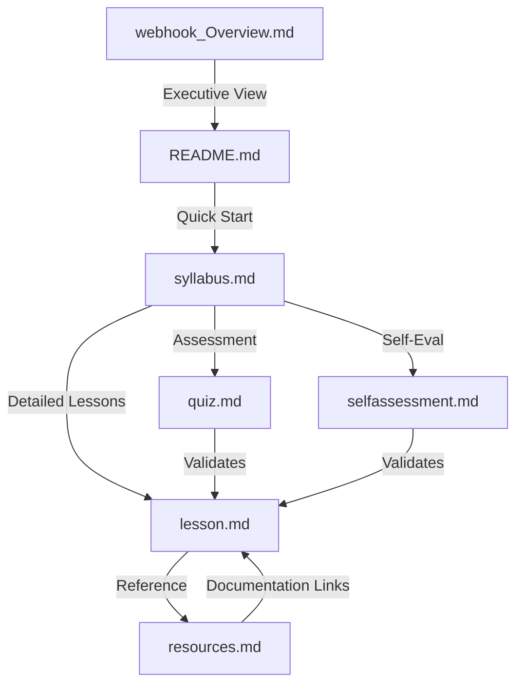
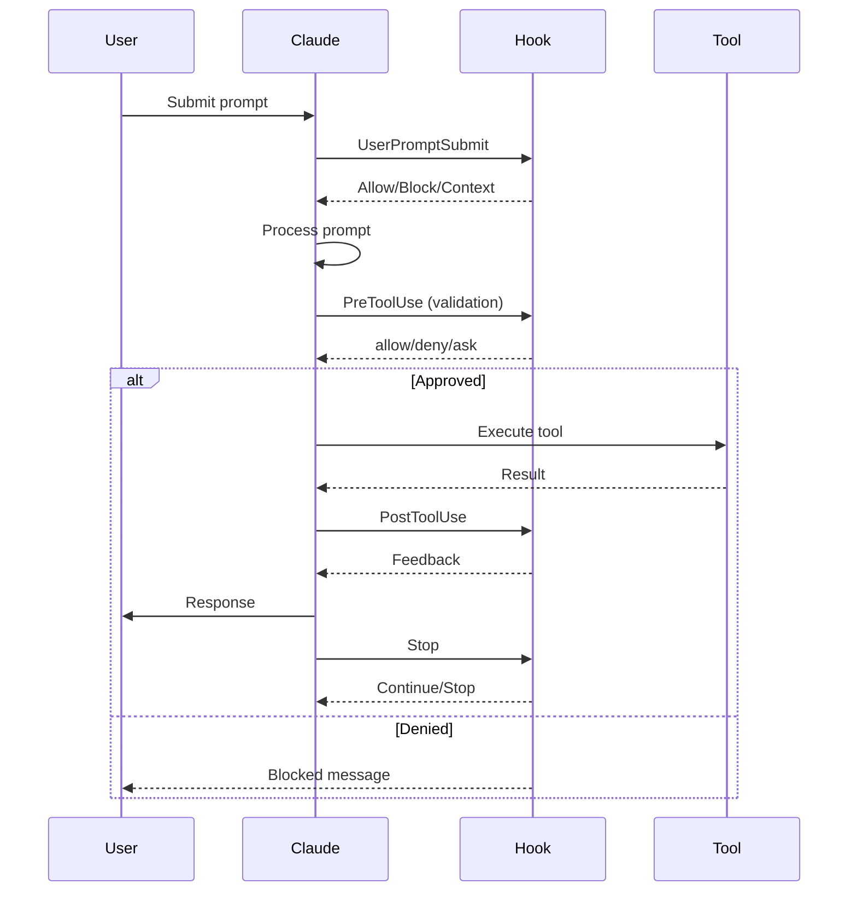
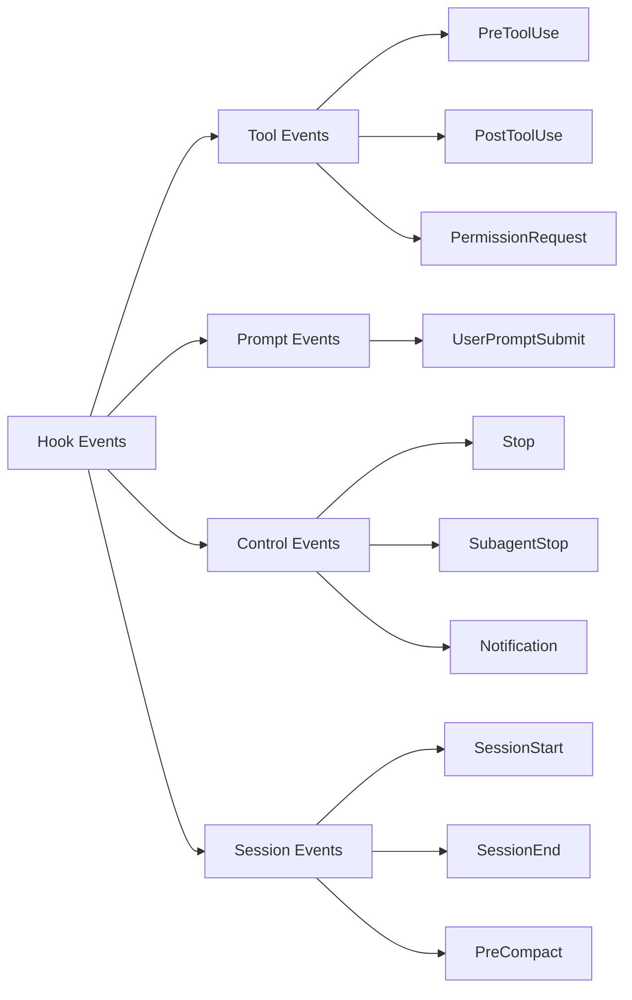
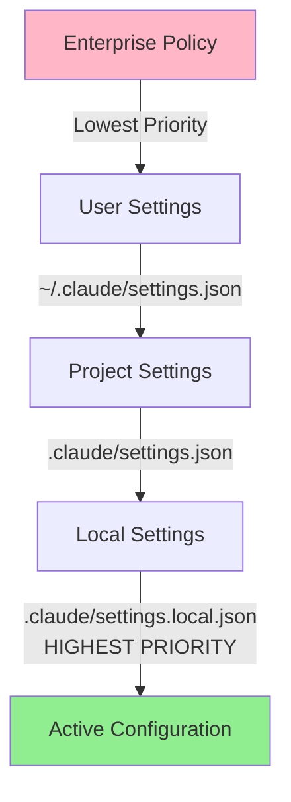
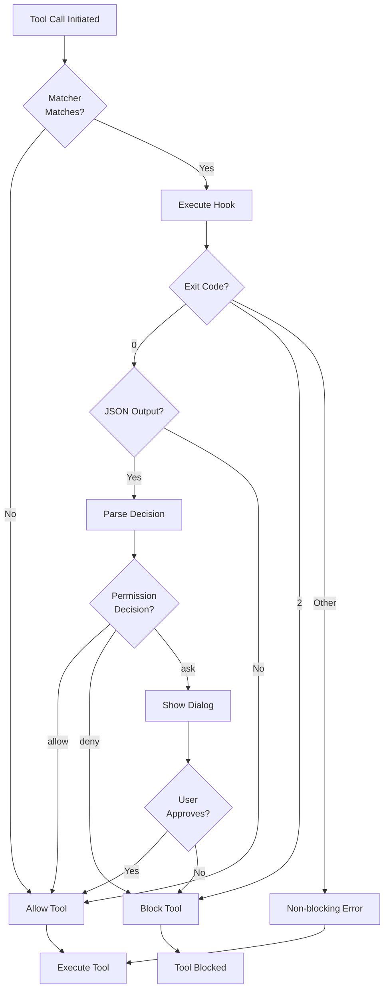
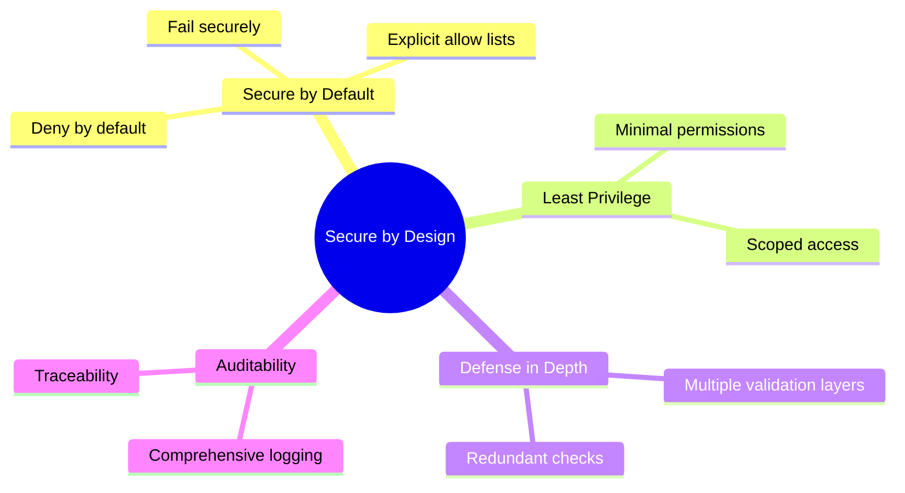

# Claude Code Hooks Training Package

**Comprehensive enterprise training for implementing Claude Code hooks with security, compliance, and best practices.**


---

## Table of Contents

1. [Quick Start](#quick-start)
2. [Package Overview](#package-overview)
3. [Training Structure](#training-structure)
4. [Prerequisites](#prerequisites)
5. [Documentation Files](#documentation-files)
6. [Hook Architecture](#hook-architecture)
7. [Configuration Examples](#configuration-examples)
8. [Security & Compliance](#security--compliance)
9. [Practical Examples](#practical-examples)
10. [Troubleshooting](#troubleshooting)
11. [Additional Resources](#additional-resources)
12. [License & Attribution](#license--attribution)

---

## Quick Start

### For Learners

1. **Review Prerequisites** - Ensure you have Claude Code CLI installed
2. **Read syllabus.md** - Understand the 2-week training structure
3. **Follow lesson.md** - Work through detailed lesson plans
4. **Complete Exercises** - Hands-on practice with each module
5. **Take Quiz** - Assess your knowledge (quiz.md)
6. **Self-Assess** - Evaluate competency (selfassessment.md)

### For Instructors

1. **Review webhook_Overview.md** - Executive summary and business case
2. **Customize syllabus** - Adapt timing to your organization
3. **Prepare Environment** - Set up sandbox for learners
4. **Monitor Progress** - Use self-assessment scores
5. **Support Deployment** - Guide production implementation

### For Executives

1. **Read webhook_Overview.md** - Business value and ROI
2. **Approve Training Time** - 2 weeks full-time per learner
3. **Review Success Metrics** - Track outcomes
4. **Plan Rollout** - Phase implementation across teams

---

## Package Overview

This training package teaches enterprise teams to implement **Claude Code hooks** - deterministic control mechanisms for AI-assisted development that ensure security, quality, and compliance.

### What You'll Learn

- Configure all 10 hook event types
- Implement security validation and guardrails
- Create auto-formatting and quality checks
- Apply UK Gov and NCSC security principles
- Deploy production-ready hook systems
- Troubleshoot and optimize performance

### Training Details

| Aspect | Details |
|--------|---------|
| **Duration** | 2 weeks (75 hours total) |
| **Format** | Self-study with practical exercises |
| **Prerequisites** | Basic CLI, JSON, Python/Bash scripting |
| **Assessment** | Quiz (80% pass) + Self-assessment + Practical projects |
| **Certification** | Completion certificate upon passing all requirements |
| **Cost** | Free - all resources freely accessible |

---

## Training Structure

### Week 1: Foundations (37.5 hours)

```
Day 1: Introduction to Hooks (7.5h)
  ├─ Hook definition and purpose
  ├─ Configuration basics
  ├─ Hook types overview
  └─ Security fundamentals

Day 2: PreToolUse & PermissionRequest (7.5h)
  ├─ PreToolUse deep dive
  ├─ Command-based hooks
  ├─ PermissionRequest patterns
  └─ Best practices

Day 3: PostToolUse & UserPromptSubmit (7.5h)
  ├─ PostToolUse fundamentals
  ├─ Auto-formatting integration
  ├─ UserPromptSubmit hooks
  └─ Skill auto-activation

Day 4: Stop, SubagentStop & Notification (7.5h)
  ├─ Stop hook introduction
  ├─ Prompt-based hooks
  ├─ SubagentStop verification
  └─ Notification integration

Day 5: Session & Lifecycle Hooks (7.5h)
  ├─ SessionStart configuration
  ├─ SessionEnd cleanup
  ├─ PreCompact operations
  └─ Lifecycle integration
```

### Week 2: Advanced Implementation (37.5 hours)

```
Day 6: Advanced Patterns (7.5h)
  ├─ Monorepo TypeScript validation
  ├─ Error handling guardrails
  ├─ MCP tool hooks
  └─ Performance optimization

Day 7: Security & Compliance (7.5h)
  ├─ Security threat modeling
  ├─ Input sanitization
  ├─ Sensitive file protection
  └─ NCSC principles application

Day 8: Development Workflow (7.5h)
  ├─ Hook testing strategies
  ├─ Script structure best practices
  ├─ Configuration management
  └─ Documentation standards

Day 9: Skills Integration (7.5h)
  ├─ Skill architecture review
  ├─ Auto-activation system
  ├─ Skill guardrails
  └─ Progressive disclosure

Day 10: Production Deployment (7.5h)
  ├─ Production examples & case studies
  ├─ Deployment checklist
  ├─ Troubleshooting
  └─ Performance monitoring
```

---

## Prerequisites

### Required Software

- **Claude Code CLI** - Latest version installed and configured
- **Python 3.8+** - For hook script development
- **Git** - Version control for configurations
- **Text Editor** - VS Code recommended
- **Node.js/npm** - For formatting tools (Prettier, ESLint)

### Required Knowledge

- Basic command-line interface usage
- JSON and YAML syntax
- Python or Bash scripting fundamentals
- Understanding of file systems and paths
- Basic Git operations

### Environment Setup

```bash
# Verify Claude Code installation
claude --version

# Create training workspace
mkdir -p ~/claude-hooks-training
cd ~/claude-hooks-training

# Initialize Claude project
mkdir .claude
touch .claude/settings.json

# Verify Python
python3 --version

# Install formatting tools (optional)
npm install -g prettier eslint
```

---

## Documentation Files

### Core Training Materials

| File | Purpose | Audience |
|------|---------|----------|
| **syllabus.md** | 2-week detailed curriculum with timing | Learners, Instructors |
| **lesson.md** | Comprehensive lesson plans for all modules | Learners |
| **resources.md** | Curated list of free training resources | All |
| **quiz.md** | 50-question knowledge test with answers | Learners, Assessors |
| **selfassessment.md** | Competency evaluation questionnaire | Learners |
| **webhook_Overview.md** | Executive summary and business case | Executives, Managers |
| **README.md** | This file - quick start and overview | All |

### File Relationships



---

## Hook Architecture

### Hook Lifecycle



### Hook Event Types



### Configuration Hierarchy



### Hook Decision Flow



---

## Configuration Examples

### Basic Hook Configuration

```json
{
  "hooks": {
    "PreToolUse": [
      {
        "matcher": "Bash",
        "hooks": [
          {
            "type": "command",
            "command": "echo 'Validating bash command...' >&2",
            "timeout": 5
          }
        ]
      }
    ]
  }
}
```

### Complete Production Configuration (YAML)

```yaml
# .claude/settings.yaml (converted to JSON for actual use)
hooks:
  # Validation Hooks
  PreToolUse:
    - matcher: "Bash"
      hooks:
        - type: command
          command: '"$CLAUDE_PROJECT_DIR"/.claude/hooks/validate-bash.py'
          timeout: 10

    - matcher: "Edit|Write"
      hooks:
        - type: command
          command: '"$CLAUDE_PROJECT_DIR"/.claude/hooks/protect-files.py'
          timeout: 5

    - matcher: "mcp__.*"
      hooks:
        - type: command
          command: '"$CLAUDE_PROJECT_DIR"/.claude/hooks/log-mcp-usage.py'
          timeout: 3

  # Auto-Approval Hooks
  PermissionRequest:
    - matcher: "Read"
      hooks:
        - type: command
          command: 'python3 -c "import json,sys;d=json.load(sys.stdin);fp=d.get(\"tool_input\",{}).get(\"file_path\",\"\");print(json.dumps({\"hookSpecificOutput\":{\"hookEventName\":\"PermissionRequest\",\"permissionDecision\":\"allow\"},\"suppressOutput\":True})) if fp.endswith((\".md\",\".txt\")) else None"'
          timeout: 2

    - matcher: "Glob|Grep"
      hooks:
        - type: command
          command: 'python3 -c "import json,sys;print(json.dumps({\"hookSpecificOutput\":{\"hookEventName\":\"PermissionRequest\",\"permissionDecision\":\"allow\"},\"suppressOutput\":True}))"'

  # Formatting Hooks
  PostToolUse:
    - matcher: "Edit|Write"
      hooks:
        - type: command
          command: 'python3 << "EOF"
import json, sys, subprocess, os
input_data = json.load(sys.stdin)
file_path = input_data.get("tool_input", {}).get("file_path", "")
if file_path.endswith((".ts", ".tsx", ".js", ".jsx")):
    subprocess.run(["npx", "prettier", "--write", file_path], stderr=subprocess.DEVNULL)
elif file_path.endswith(".py"):
    subprocess.run(["black", file_path], stderr=subprocess.DEVNULL)
sys.exit(0)
EOF'
          timeout: 30

  # Context Injection
  UserPromptSubmit:
    - hooks:
        - type: command
          command: '"$CLAUDE_PROJECT_DIR"/.claude/hooks/add-context.sh'
          timeout: 5

  # Intelligent Stop
  Stop:
    - hooks:
        - type: prompt
          prompt: |
            Evaluate if Claude should continue working.
            Check: $ARGUMENTS
            Return {"decision": "approve"} if all tasks complete, else {"decision": "block", "reason": "More work needed"}
          timeout: 30

  # Session Management
  SessionStart:
    - hooks:
        - type: command
          command: '"$CLAUDE_PROJECT_DIR"/.claude/hooks/setup-environment.sh'
          timeout: 60

  SessionEnd:
    - hooks:
        - type: command
          command: '"$CLAUDE_PROJECT_DIR"/.claude/hooks/cleanup.sh'
          timeout: 30
```

### Hook Script Template (Python)

```python
#!/usr/bin/env python3
"""
Hook: [Name]
Event: [PreToolUse/PostToolUse/etc.]
Purpose: [Description]
"""
import json
import sys
import os

def main():
    # Load input safely
    try:
        input_data = json.load(sys.stdin)
    except json.JSONDecodeError as e:
        print(f"JSON error: {e}", file=sys.stderr)
        sys.exit(1)

    # Extract relevant fields
    tool_name = input_data.get('tool_name', '')
    tool_input = input_data.get('tool_input', {})

    # Implement validation logic
    if should_block(tool_input):
        print("Blocked: [reason]", file=sys.stderr)
        sys.exit(2)  # Block execution

    # Allow execution
    sys.exit(0)

def should_block(tool_input):
    """Implement your validation logic here."""
    return False

if __name__ == '__main__':
    main()
```

### Hook Script Template (Bash)

```bash
#!/bin/bash
# Hook: [Name]
# Event: [Event Type]
# Purpose: [Description]

set -euo pipefail

# Read JSON input
INPUT=$(cat)

# Extract fields using jq
TOOL_NAME=$(echo "$INPUT" | jq -r '.tool_name // ""')
FILE_PATH=$(echo "$INPUT" | jq -r '.tool_input.file_path // ""')

# Validation logic
if [[ "$FILE_PATH" == *".env"* ]]; then
    echo "Blocked: Cannot modify .env file" >&2
    exit 2
fi

# Allow
exit 0
```

---

## Security & Compliance

### UK Government Secure by Design Principles



### NCSC AI Security Principles

1. **Know Your System**
   - Document all hooks
   - Understand attack surface
   - Maintain hook inventory

2. **Protect Supply Chain**
   - Review external hooks
   - Verify sources
   - Monitor modifications

3. **Protect Data**
   - Sanitize inputs
   - Prevent data leakage
   - Secure logging

4. **Protect AI Systems**
   - Validate prompts
   - Block sensitive input
   - Monitor patterns

5. **Control Access**
   - Project-specific configs
   - No secrets in settings
   - Regular reviews

### Security Checklist

```yaml
security_checklist:
  input_validation:
    - [ ] Path traversal prevention
    - [ ] Command injection protection
    - [ ] JSON injection protection
    - [ ] Regex validation for patterns

  file_protection:
    - [ ] .env files blocked
    - [ ] Git internals protected
    - [ ] Credentials/secrets blocked
    - [ ] SSH keys protected
    - [ ] Lock files protected

  code_security:
    - [ ] Error handling implemented
    - [ ] Environment variables quoted
    - [ ] No hardcoded credentials
    - [ ] Proper exit codes used

  operational:
    - [ ] Audit logging enabled
    - [ ] Timeout configured
    - [ ] Documentation written
    - [ ] Code reviewed
    - [ ] Tested with malicious inputs

  compliance:
    - [ ] UK Gov principles applied
    - [ ] NCSC guidelines followed
    - [ ] Deny-by-default architecture
    - [ ] Least privilege enforced
```

---

## Practical Examples

### Example 1: Bash Command Validator

**File:** `.claude/hooks/validate-bash.py`

```python
#!/usr/bin/env python3
"""Validates Bash commands for dangerous operations."""
import json
import re
import sys

DANGEROUS_PATTERNS = [
    (r'\brm\s+-rf\s+/', "Recursive delete from root"),
    (r'\bchmod\s+777', "Overly permissive permissions"),
    (r'\bcurl\s+.*\|\s*bash', "Piping remote script to bash"),
    (r'\>\/dev\/sd', "Write to block device"),
]

def main():
    try:
        input_data = json.load(sys.stdin)
    except json.JSONDecodeError:
        sys.exit(1)

    if input_data.get('tool_name') != 'Bash':
        sys.exit(0)

    command = input_data.get('tool_input', {}).get('command', '')

    for pattern, description in DANGEROUS_PATTERNS:
        if re.search(pattern, command, re.IGNORECASE):
            print(f"BLOCKED: {description}", file=sys.stderr)
            sys.exit(2)

    sys.exit(0)

if __name__ == '__main__':
    main()
```

**Configuration:**

```json
{
  "hooks": {
    "PreToolUse": [
      {
        "matcher": "Bash",
        "hooks": [
          {
            "type": "command",
            "command": "\"$CLAUDE_PROJECT_DIR\"/.claude/hooks/validate-bash.py",
            "timeout": 5
          }
        ]
      }
    ]
  }
}
```

### Example 2: Auto-Format TypeScript

**File:** `.claude/hooks/format-code.py`

```python
#!/usr/bin/env python3
"""Auto-format code files after Write/Edit."""
import json
import sys
import subprocess

input_data = json.load(sys.stdin)
file_path = input_data.get('tool_input', {}).get('file_path', '')

if file_path.endswith(('.ts', '.tsx', '.js', '.jsx')):
    subprocess.run(['npx', 'prettier', '--write', file_path],
                   stderr=subprocess.DEVNULL, check=False)
    print("Formatted with Prettier", file=sys.stderr)
elif file_path.endswith('.py'):
    subprocess.run(['black', file_path],
                   stderr=subprocess.DEVNULL, check=False)
    print("Formatted with Black", file=sys.stderr)

sys.exit(0)
```

### Example 3: Sensitive File Protection

```python
#!/usr/bin/env python3
"""Protect sensitive files from modification."""
import json
import sys

PROTECTED_PATTERNS = {
    '.env': 'Environment variables',
    '.git/': 'Git internals',
    'id_rsa': 'SSH private key',
    'secrets': 'Secrets file',
    'credentials': 'Credentials file',
}

input_data = json.load(sys.stdin)
tool_name = input_data.get('tool_name', '')

if tool_name not in ['Write', 'Edit', 'Bash']:
    sys.exit(0)

file_path = input_data.get('tool_input', {}).get('file_path', '')
command = input_data.get('tool_input', {}).get('command', '')
target = file_path or command

for pattern, description in PROTECTED_PATTERNS.items():
    if pattern in target.lower():
        output = {
            "hookSpecificOutput": {
                "hookEventName": "PreToolUse",
                "permissionDecision": "deny",
                "permissionDecisionReason": f"Protected: {description}"
            }
        }
        print(json.dumps(output))
        sys.exit(0)

sys.exit(0)
```

### Example 4: Session Environment Setup

**File:** `.claude/hooks/setup-environment.sh`

```bash
#!/bin/bash
# SessionStart: Load project environment

set -euo pipefail

# Load Node.js version
export NVM_DIR="$HOME/.nvm"
[ -s "$NVM_DIR/nvm.sh" ] && \. "$NVM_DIR/nvm.sh"
nvm use 18

# Set project-specific env vars
export NODE_ENV=development
export DEBUG=true

# Persist for session
if [ -n "${CLAUDE_ENV_FILE:-}" ]; then
    cat >> "$CLAUDE_ENV_FILE" << EOF
export NODE_ENV=development
export DEBUG=true
export PROJECT_ROOT="$CLAUDE_PROJECT_DIR"
EOF
fi

echo "Environment configured" >&2
exit 0
```

---

## Troubleshooting

### Common Issues

#### Issue 1: Hook Not Executing

**Symptoms:** Hook doesn't run, no output visible

**Solutions:**
```bash
# Check JSON syntax
cat .claude/settings.json | jq .

# Verify matcher pattern
echo '{"tool_name": "Bash"}' | jq '.tool_name | test("Bash")'

# Test hook manually
echo '{"tool_name":"Bash","tool_input":{"command":"ls"}}' | .claude/hooks/your-hook.py

# Check permissions
chmod +x .claude/hooks/your-hook.py

# Enable debug mode
claude --debug
```

#### Issue 2: Permission Denied

**Symptoms:** Hook fails with permission error

**Solutions:**
```bash
# Make script executable
chmod +x .claude/hooks/*.py

# Check file ownership
ls -la .claude/hooks/

# Verify CLAUDE_PROJECT_DIR
echo "$CLAUDE_PROJECT_DIR"

# Use absolute paths
"$CLAUDE_PROJECT_DIR"/.claude/hooks/script.py
```

#### Issue 3: Timeout

**Symptoms:** Hook execution times out

**Solutions:**
```json
{
  "hooks": {
    "PreToolUse": [
      {
        "matcher": "Bash",
        "hooks": [
          {
            "type": "command",
            "command": "...",
            "timeout": 120
          }
        ]
      }
    ]
  }
}
```

#### Issue 4: JSON Parse Errors

**Symptoms:** "Invalid JSON" errors

**Solutions:**
```python
# Add robust error handling
try:
    input_data = json.load(sys.stdin)
except json.JSONDecodeError as e:
    print(f"JSON error: {e}", file=sys.stderr)
    sys.exit(1)

# Validate JSON externally
cat input.json | jq .

# Use json.dumps for output
print(json.dumps(response))  # Not string formatting
```

### Debug Commands

```bash
# View registered hooks
/hooks

# Check Claude Code version
claude --version

# Validate settings file
cat .claude/settings.json | jq '.hooks | keys'

# Test hook with sample input
echo '{"tool_name":"Write","tool_input":{"file_path":"test.txt"}}' | \
  python3 .claude/hooks/your-hook.py

# Monitor hook execution
claude --debug 2>&1 | grep -i hook

# Check hook logs
tail -f ~/.claude/hook-logs/decisions.log
```

---

## Additional Resources

### Official Documentation

- [Hooks Reference](https://code.claude.com/docs/en/hooks.md)
- [Hooks Quickstart](https://code.claude.com/docs/en/hooks-guide.md)
- [Security Guide](https://code.claude.com/docs/en/security.md)
- [Settings Configuration](https://code.claude.com/docs/en/settings.md)

### GitHub Repositories

- [Infrastructure Showcase](https://github.com/diet103/claude-code-infrastructure-showcase) - Production hook examples

### Compliance Resources

- [UK Gov Secure by Design](https://www.gov.uk/government/publications/secure-by-design)
- [NCSC AI Guidelines](https://www.ncsc.gov.uk/collection/guidelines-secure-ai-system-development)
- [NCSC ML Security Principles](https://www.ncsc.gov.uk/collection/machine-learning/principles-for-the-security-of-machine-learning)

### Community

- GitHub Issues: [Report bugs](https://github.com/anthropics/claude-code/issues)
- Claude Code CLI: Use `/feedback` command for questions

---

## License & Attribution

### Training Package

**Author:** AI Training Development Team
**Version:** 1.0
**Date:** 2025-12-10
**License:** Internal Use - Educational Purposes

### Claude Code

Claude Code is developed by Anthropic PBC.
- **Documentation:** Copyright Anthropic PBC
- **Usage:** Subject to Claude Code terms of service

### Compliance Frameworks

- **UK Government Publications:** Crown Copyright, Open Government License
- **NCSC Guidelines:** © Crown copyright, Open Government License

---

## Quick Reference Card

### Hook Events

| Event | When | Can Block | Use For |
|-------|------|-----------|---------|
| PreToolUse | Before tool | Yes | Validation, blocking |
| PostToolUse | After tool | Yes | Formatting, feedback |
| PermissionRequest | Dialog shown | Yes | Auto-approval |
| UserPromptSubmit | User input | Yes | Context, validation |
| Stop | Response done | Yes | Continue/stop logic |
| SubagentStop | Subagent done | Yes | Verify completion |
| Notification | Alert sent | No | Custom alerts |
| SessionStart | Session begins | No | Environment setup |
| SessionEnd | Session ends | No | Cleanup, logging |
| PreCompact | Before compact | No | Pre-compact tasks |

### Exit Codes

- **0** - Success (allow, process JSON output)
- **2** - Block (deny tool, show stderr only)
- **Other** - Non-blocking error (show stderr, allow tool)

### Essential Commands

```bash
# View hooks
/hooks

# Debug mode
claude --debug

# Validate JSON
jq . .claude/settings.json

# Test hook
echo '{}' | ./hook.py

# Make executable
chmod +x hook.py
```

---

**Questions?** Use Claude Code `/feedback` command or consult lesson.md for detailed explanations.

**Ready to start?** Begin with syllabus.md → Follow lesson.md → Practice → Assess with quiz.md

---

*This training package aligns with UK Government Secure by Design for AI and NCSC Secure Design Principles.*
