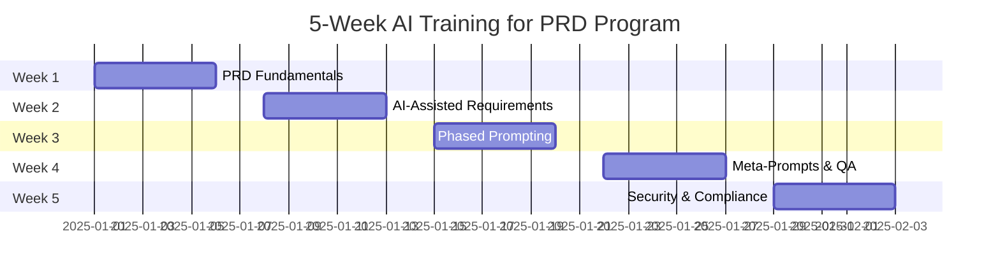
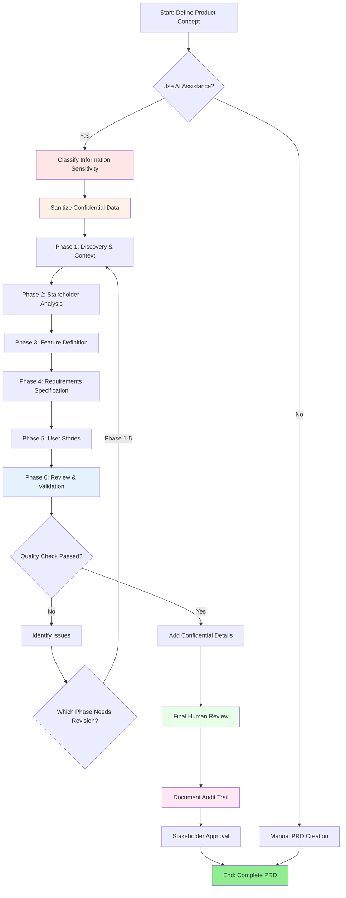
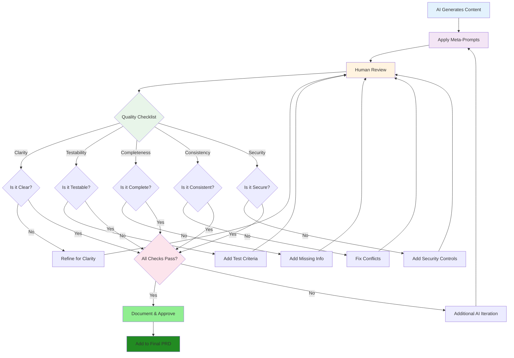
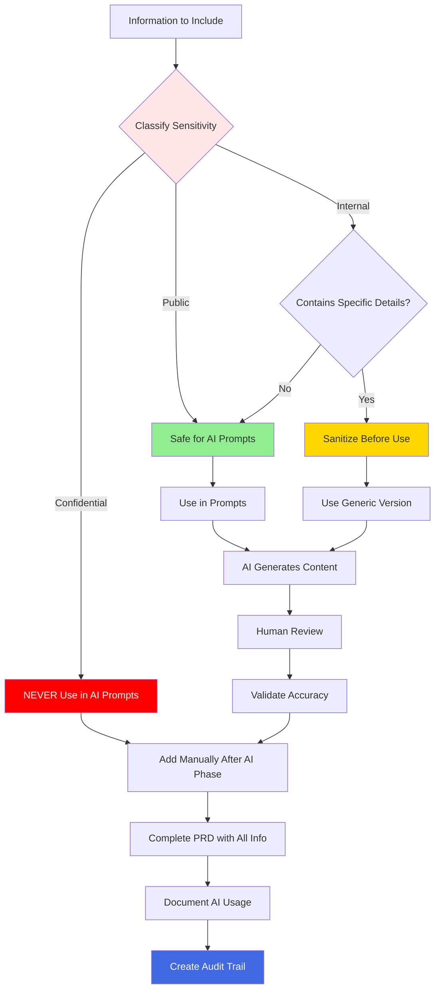
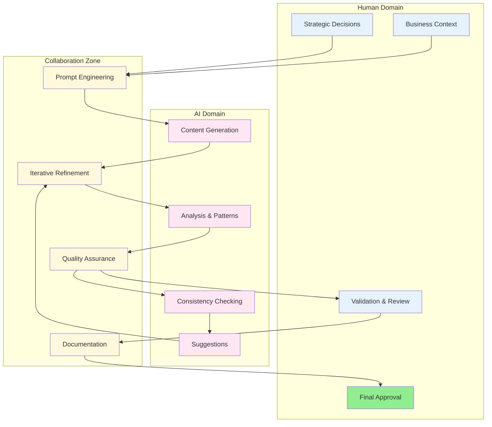
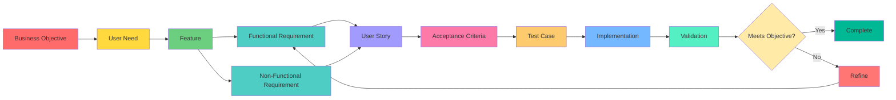
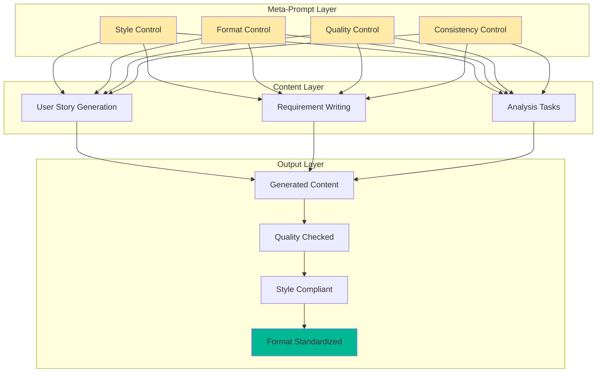
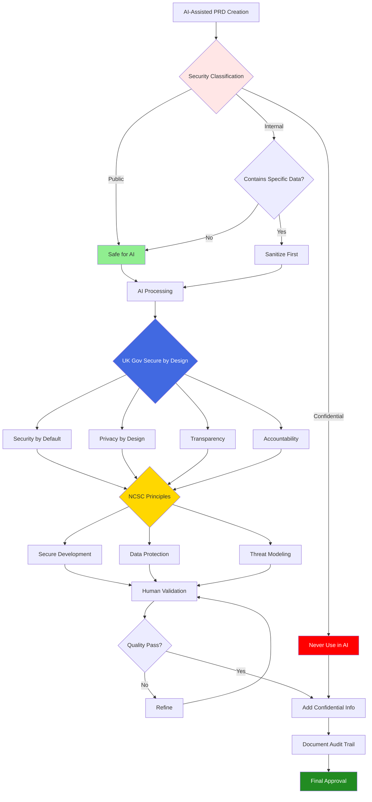

# AI Training for Product Requirements Documents

**Version**: 1.0
**Last Updated**: 2025-12-10
**Program Duration**: 5 weeks (187.5 hours)
**Compliance**: UK Gov Secure by Design for AI, NCSC Secure Design Principles

---

## Table of Contents

1. [Overview](#overview)
2. [Getting Started](#getting-started)
3. [Program Structure](#program-structure)
4. [Course Materials](#course-materials)
5. [Learning Workflows](#learning-workflows)
6. [Technical Setup](#technical-setup)
7. [YAML Configuration Examples](#yaml-configuration-examples)
8. [Mermaid Diagrams](#mermaid-diagrams)
9. [Assessment and Certification](#assessment-and-certification)
10. [Support and Resources](#support-and-resources)
11. [Frequently Asked Questions](#frequently-asked-questions)

---

## Overview

### What is This Program?

This comprehensive training package teaches professionals how to use Artificial Intelligence tools (specifically Claude AI and similar large language models) to create high-quality Product Requirements Documents. The program emphasizes structured prompting techniques, phased development methodologies, and meta-prompt strategies.

### Who Should Take This Course?

- Enterprise Architects
- Product Managers
- Business Analysts
- Technical Writers
- Project Managers
- Requirements Engineers
- Anyone creating product documentation

### Key Learning Outcomes

By completing this program, you will be able to:

1. Create comprehensive, professional PRDs
2. Effectively use Claude AI for requirements engineering
3. Apply prompt engineering techniques
4. Implement phased prompting methodologies
5. Design and deploy meta-prompts
6. Apply UK Gov and NCSC security principles
7. Prevent and detect AI hallucinations
8. Maintain compliance and audit trails
9. Practice ethical AI usage
10. Produce enterprise-grade documentation efficiently

### Program Philosophy

This training emphasizes:
- **Practical Application**: Hands-on exercises with real projects
- **Security First**: UK Gov and NCSC compliance throughout
- **Human-in-the-Loop**: AI assists, humans validate and decide
- **Quality Focus**: Meta-prompts and validation workflows
- **Ethical Practice**: Responsible AI usage and transparency

---

## Getting Started

### Prerequisites

**Knowledge**:
- Basic understanding of software development
- Familiarity with documentation practices
- No AI experience required

**Technical Requirements**:
- Computer with internet connection
- Modern web browser
- Text editor for markdown editing
- Access to Claude AI (free tier sufficient)
- GitHub account (free)

**Time Commitment**:
- 37.5 hours per week
- 5 weeks total
- Self-paced with suggested schedule

### Quick Start Guide

1. **Read the Overview** (this document) - 30 minutes
2. **Review the Syllabus** - 1 hour
3. **Set up Claude AI account** - 15 minutes
4. **Start Week 1, Lesson 1** - Begin learning
5. **Follow the daily schedule** - Stay on track
6. **Complete all exercises** - Practice is essential
7. **Take assessments** - Validate your learning

### Installation and Setup

No complex installation required. You'll need:

```bash
# Optional: Install a markdown editor
# VS Code (recommended)
# Download from: https://code.visualstudio.com/

# Optional: Git for version control
sudo apt-get install git  # Linux
brew install git          # macOS
# Windows: Download from https://git-scm.com/
```

### Creating Your Workspace

```bash
# Create a directory for your work
mkdir ~/prd-training
cd ~/prd-training

# Create subdirectories
mkdir -p {week1,week2,week3,week4,week5,templates,prompts,projects}

# Initialize git repository (optional but recommended)
git init
```

---

## Program Structure

### Weekly Overview



### Daily Schedule Template

Each day follows this structure:

| Time | Activity | Duration |
|------|----------|----------|
| 09:00-10:30 | Session 1: Learning | 1.5 hours |
| 10:30-10:45 | Break | 15 minutes |
| 10:45-12:15 | Session 1: Practice | 1.5 hours |
| 12:15-13:15 | Lunch Break | 1 hour |
| 13:15-14:45 | Session 2: Learning | 1.5 hours |
| 14:45-15:00 | Break | 15 minutes |
| 15:00-16:30 | Session 2: Practice | 1.5 hours |
| 16:30-17:00 | Review & Planning | 30 minutes |

**Total Daily Hours**: 7.5 hours (excluding lunch)

### Learning Progression


---

## Course Materials

### Document Structure

This training package includes:

| Document | Description | Pages |
|----------|-------------|-------|
| **README.md** | This file - overview and usage guide | 25+ |
| **prd_Overview.md** | Executive summary | 8 |
| **syllabus.md** | Detailed 5-week schedule | 35+ |
| **lesson.md** | Detailed lesson plans | 60+ |
| **resources.md** | Curated resource list | 12 |
| **selfassessment.md** | Self-evaluation questionnaire | 20 |
| **quiz.md** | Knowledge test with answers | 25 |

### Resource Categories

All resources are **free and require no registration**:

- **Video Tutorials**: YouTube channels (Anthropic, Net Ninja, NetworkChuck, TechWorld with Nana)
- **Documentation**: Official guides (Anthropic, GitHub)
- **Government Resources**: UK Gov, NCSC security guidelines
- **Templates**: Open-source PRD templates
- **Tools**: Claude AI, Mermaid diagrams, YAML

### Weekly Material Focus

**Week 1**: PRD fundamentals, requirements engineering, user stories
**Week 2**: Claude AI documentation, prompt engineering guides
**Week 3**: Meta AI PRD framework, phased prompting techniques
**Week 4**: Meta-prompt examples, quality control frameworks
**Week 5**: UK Gov Secure by Design, NCSC AI security guidelines

---

## Learning Workflows

### PRD Creation Workflow



### Phased Prompting Workflow

```mermaid
flowchart LR
    subgraph Phase1 [Phase 1: Discovery]
        P1[Problem Definition]
        P2[Business Objectives]
        P3[Success Metrics]
    end

    subgraph Phase2 [Phase 2: Analysis]
        P4[User Personas]
        P5[Stakeholder Matrix]
        P6[User Journeys]
    end

    subgraph Phase3 [Phase 3: Features]
        P7[Feature List]
        P8[Prioritization]
        P9[Dependencies]
    end

    subgraph Phase4 [Phase 4: Requirements]
        P10[Functional Reqs]
        P11[Non-Functional Reqs]
        P12[Constraints]
    end

    subgraph Phase5 [Phase 5: Stories]
        P13[User Stories]
        P14[Acceptance Criteria]
        P15[Story Mapping]
    end

    subgraph Phase6 [Phase 6: Review]
        P16[Completeness Check]
        P17[Consistency Validation]
        P18[Final Polish]
    end

    Phase1 -->|Context| Phase2
    Phase2 -->|Users & Stakeholders| Phase3
    Phase3 -->|Features| Phase4
    Phase4 -->|Requirements| Phase5
    Phase5 -->|Stories| Phase6
    Phase6 -->|Iterate if needed| Phase1

    style Phase1 fill:#e3f2fd
    style Phase2 fill:#f3e5f5
    style Phase3 fill:#e8f5e9
    style Phase4 fill:#fff3e0
    style Phase5 fill:#fce4ec
    style Phase6 fill:#e0f2f1
```



### Quality Assurance Workflow



### Security Classification Workflow



---

## Technical Setup

### Claude AI Setup

1. **Create Account**:
   - Visit: https://claude.ai
   - Sign up with email (free tier available)
   - Verify email address

2. **Understand Limits**:
   - Free tier: Limited messages per day
   - Context window: Up to 200K tokens
   - Rate limits: May need to wait between sessions

3. **Best Practices**:
   - Save important prompts and responses
   - Work in focused sessions
   - Monitor usage limits

### Recommended Tools

```yaml
# Development Environment
editor:
  primary: "VS Code"
  alternatives:
    - "Sublime Text"
    - "Atom"
    - "Notepad++"
  extensions:
    - "Markdown All in One"
    - "Mermaid Preview"
    - "YAML"

# Version Control
version_control:
  tool: "Git"
  hosting: "GitHub (optional)"

# Diagramming
diagrams:
  tool: "Mermaid"
  preview: "VS Code extension or https://mermaid.live"

# Documentation
documentation:
  format: "Markdown (.md)"
  viewer: "GitHub, VS Code, or any markdown viewer"
```

### File Organization

```
prd-training/
├── week1/
│   ├── exercises/
│   ├── deliverables/
│   └── notes.md
├── week2/
│   ├── exercises/
│   ├── deliverables/
│   ├── prompts.md
│   └── notes.md
├── week3/
│   ├── exercises/
│   ├── deliverables/
│   ├── phase_templates/
│   └── notes.md
├── week4/
│   ├── exercises/
│   ├── deliverables/
│   ├── meta_prompts/
│   └── notes.md
├── week5/
│   ├── exercises/
│   ├── deliverables/
│   ├── security_checklists/
│   └── notes.md
├── templates/
│   ├── prd_template.md
│   ├── user_story_template.md
│   └── requirements_matrix.xlsx
├── prompts/
│   ├── phase1_prompts.md
│   ├── phase2_prompts.md
│   ├── meta_prompts.md
│   └── validation_prompts.md
└── projects/
    ├── project1_banking_app/
    ├── project2_healthcare_portal/
    └── final_project/
```

---

## YAML Configuration Examples

### Training Configuration

```yaml
# training_config.yaml
# Configuration for AI-assisted PRD creation training

program:
  name: "AI Training for Product Requirements Documents"
  version: "1.0"
  duration_weeks: 5
  hours_per_week: 37.5
  total_hours: 187.5
  format: "self-paced"

schedule:
  daily_hours: 7.5
  sessions_per_day: 2
  session_duration: "3.5-4 hours"
  breaks:
    short: "15 minutes"
    lunch: "1 hour"

weeks:
  - week: 1
    title: "PRD Fundamentals and Structure"
    topics:
      - "PRD components and structure"
      - "Requirements engineering basics"
      - "User stories and acceptance criteria"
      - "Stakeholder management"
    deliverables:
      - "PRD comparison table"
      - "20 categorized requirements"
      - "15 user stories with acceptance criteria"
      - "Stakeholder analysis matrix"

  - week: 2
    title: "AI-Assisted Requirements Engineering"
    topics:
      - "Claude AI fundamentals"
      - "Prompt engineering"
      - "AI output validation"
      - "Quality control"
    deliverables:
      - "Prompt template library"
      - "AI-assisted PRD"
      - "Validation checklist"
      - "Human-in-the-loop workflow"

  - week: 3
    title: "Phased Prompting Methodology"
    topics:
      - "Phase design and sequencing"
      - "Context management"
      - "Phase templates"
      - "Workflow orchestration"
    deliverables:
      - "6-phase workflow design"
      - "Phase prompt templates"
      - "Context handoff strategy"
      - "Complete phased PRD"

  - week: 4
    title: "Meta-Prompts and Quality Control"
    topics:
      - "Meta-prompt concepts"
      - "Style and format control"
      - "Quality assurance"
      - "Template generation"
    deliverables:
      - "Style guide meta-prompt"
      - "QA meta-prompt suite"
      - "Meta-prompt library"
      - "PRD with meta-prompts"

  - week: 5
    title: "Security, Compliance, and Professional Practice"
    topics:
      - "UK Gov Secure by Design"
      - "NCSC security principles"
      - "Data protection"
      - "Audit trails"
    deliverables:
      - "Security compliance checklist"
      - "Data classification scheme"
      - "Audit trail documentation"
      - "Final compliant PRD"

assessment:
  self_assessment:
    format: "questionnaire"
    questions: 40
    passing_score: 80

  knowledge_quiz:
    format: "multiple_choice"
    questions: 100
    passing_score: 80
    time_limit_minutes: 90

  final_project:
    type: "Complete PRD"
    requirements:
      - "All security principles applied"
      - "Phased methodology used"
      - "Meta-prompts implemented"
      - "Complete audit trail"
      - "20-30 pages"

certification:
  requirements:
    - "Complete all 5 weeks"
    - "Finish all exercises"
    - "Self-assessment ≥ 80%"
    - "Quiz score ≥ 80%"
    - "Complete final project"

compliance:
  frameworks:
    - "UK Government Secure by Design for AI"
    - "NCSC Secure Design Principles for AI"
  data_handling:
    - "No confidential information in AI prompts"
    - "All resources free and no registration required"
```

### PRD Template Configuration

```yaml
# prd_template_config.yaml
# Configuration for PRD structure and content

document:
  title: "Product Requirements Document"
  version: "1.0"
  status: "Draft | Review | Approved"

metadata:
  product_name: "[Product Name]"
  author: "[Your Name]"
  created_date: "YYYY-MM-DD"
  last_updated: "YYYY-MM-DD"
  approvers:
    - role: "Product Manager"
      name: "[Name]"
    - role: "Technical Lead"
      name: "[Name]"
    - role: "Stakeholder"
      name: "[Name]"

sections:
  - section: "Executive Summary"
    required: true
    max_length: "1 page"
    content:
      - "Product overview"
      - "Business objectives"
      - "Key features"
      - "Success metrics"

  - section: "Problem Statement"
    required: true
    content:
      - "Current situation"
      - "Pain points"
      - "Opportunity"
      - "Target users"

  - section: "Goals and Objectives"
    required: true
    format: "SMART objectives"
    minimum: 3
    maximum: 7

  - section: "User Personas"
    required: true
    minimum_personas: 2
    attributes:
      - "Name and role"
      - "Demographics"
      - "Goals and motivations"
      - "Pain points"
      - "Technical proficiency"

  - section: "Functional Requirements"
    required: true
    format: "Table"
    columns:
      - "ID (FR-001, FR-002, etc.)"
      - "Requirement (The system shall...)"
      - "Priority (High/Medium/Low)"
      - "Category"
    minimum: 20

  - section: "Non-Functional Requirements"
    required: true
    categories:
      - "Performance"
      - "Security"
      - "Usability"
      - "Reliability"
      - "Scalability"
    minimum: 10

  - section: "User Stories"
    required: true
    format: "As a [persona], I want [goal] so that [benefit]"
    criteria: "INVEST"
    acceptance_criteria: "Given-When-Then"
    minimum: 30

  - section: "Success Metrics"
    required: true
    types:
      - "Usage metrics"
      - "Performance metrics"
      - "Business metrics"
      - "User satisfaction"
    minimum: 5

  - section: "Dependencies and Constraints"
    required: true
    content:
      - "Technical dependencies"
      - "External dependencies"
      - "Business constraints"
      - "Timeline constraints"

  - section: "Risks and Mitigation"
    required: true
    format: "Table"
    columns:
      - "Risk"
      - "Likelihood"
      - "Impact"
      - "Mitigation strategy"

  - section: "Timeline and Milestones"
    required: false
    content:
      - "Major milestones"
      - "Dependencies"
      - "Critical path"

ai_usage:
  document_percentage: "[X]% AI-assisted"
  phases_used:
    - "Discovery"
    - "Requirements gathering"
    - "User story generation"
  validation:
    method: "Human review and validation"
    validator: "[Name]"
    date: "YYYY-MM-DD"
  audit_trail:
    location: "[Path to audit trail document]"
    prompts_documented: true

security:
  classification: "Public | Internal | Confidential"
  compliance:
    - "UK Gov Secure by Design for AI"
    - "NCSC Secure Design Principles"
  data_protection:
    - "No personal identifiable information"
    - "No confidential customer data"
    - "Generic examples used"
```

### Prompt Library Configuration

```yaml
# prompt_library_config.yaml
# Configuration for organizing and managing prompts

prompt_library:
  name: "PRD Prompt Library"
  version: "1.0"
  last_updated: "2025-12-10"

categories:
  - category: "Content Generation"
    prompts:
      - id: "CG-001"
        name: "Generate User Stories"
        phase: "Phase 5"
        template: |
          You are a product owner writing user stories for {product_name}.
          Create {count} user stories for the {feature_name} feature.
          Format: "As a [user type], I want [goal] so that [benefit]"
          Ensure each story follows INVEST criteria.
        variables:
          - "product_name"
          - "count"
          - "feature_name"

      - id: "CG-002"
        name: "Generate Functional Requirements"
        phase: "Phase 4"
        template: |
          You are a business analyst defining requirements for {product_name}.
          Write {count} functional requirements for {feature_name}.
          Start each with "The system shall..."
          Make each specific, testable, and focused.
        variables:
          - "product_name"
          - "count"
          - "feature_name"

  - category: "Analysis and Review"
    prompts:
      - id: "AR-001"
        name: "Identify Requirements Gaps"
        phase: "Phase 6"
        template: |
          You are reviewing a PRD for completeness.
          Current requirements: {requirements_list}
          Identify 5-7 potential gaps in: error handling, security,
          performance, usability, and data validation.
        variables:
          - "requirements_list"

      - id: "AR-002"
        name: "Check Requirement Clarity"
        phase: "Phase 6"
        template: |
          You are a technical writer improving requirement clarity.
          Review this requirement: {requirement}
          Rewrite to be specific, unambiguous, and testable.
          Explain improvements made.
        variables:
          - "requirement"

  - category: "Meta-Prompts"
    prompts:
      - id: "MP-001"
        name: "Style Guide Meta-Prompt"
        type: "control"
        scope: "global"
        template: |
          STYLE GUIDE:
          - Use professional, formal language
          - Write in active voice
          - Start functional requirements with "The system shall"
          - Use "user" not "customer"
          - Keep sentences under 25 words
          - Avoid ambiguous terms: fast, easy, user-friendly

      - id: "MP-002"
        name: "Quality Assurance Meta-Prompt"
        type: "validation"
        scope: "all_requirements"
        template: |
          QUALITY CHECKLIST:
          ☐ Clear and unambiguous
          ☐ Testable and verifiable
          ☐ Complete with necessary details
          ☐ Consistent with other requirements
          ☐ Feasible and realistic
          For failing items, provide specific improvements.

usage_tracking:
  track_usage: true
  metrics:
    - "Prompt effectiveness"
    - "Number of iterations needed"
    - "Quality of outputs"
    - "Time saved"

maintenance:
  review_frequency: "quarterly"
  version_control: true
  backup: true
  sharing:
    team: true
    organization: true
```

---

## Mermaid Diagrams

### AI-Assisted PRD Architecture



### Requirements Traceability



### Meta-Prompt Layer Architecture



### Security Compliance Framework



---

## Assessment and Certification

### Assessment Overview

```mermaid
graph LR
    A[Start Training] --> B[Week 1 Complete]
    B --> C[Week 1 Self-Assessment]
    C --> D[Week 2 Complete]
    D --> E[Week 2 Self-Assessment]
    E --> F[Week 3 Complete]
    F --> G[Week 3 Self-Assessment]
    G --> H[Week 4 Complete]
    H --> I[Week 4 Self-Assessment]
    I --> J[Week 5 Complete]
    J --> K[Final Self-Assessment]
    K --> L[Knowledge Quiz]
    L --> M[Final Project]
    M --> N{All Pass?}
    N -->|Yes| O[Certification]
    N -->|No| P[Additional Study]
    P --> K

    style A fill:#e3f2fd
    style O fill:#228B22,color:#fff
    style N fill:#FFD700
    style P fill:#ff7675
```



### Certification Requirements

To achieve certification, you must:

| Requirement | Target | Status |
|-------------|--------|--------|
| Complete all 5 weeks | 187.5 hours | ☐ |
| Finish all exercises | 100% | ☐ |
| Weekly self-assessments | Average ≥ 80% | ☐ |
| Final self-assessment | ≥ 144/180 points (80%) | ☐ |
| Knowledge quiz | ≥ 80/100 (80%) | ☐ |
| Final PRD project | Completed & approved | ☐ |
| Prompt library | Created & documented | ☐ |
| Audit trail | Complete documentation | ☐ |

### Performance Metrics

Track your progress:

```yaml
# performance_tracking.yaml

learner:
  name: "[Your Name]"
  start_date: "YYYY-MM-DD"
  target_completion: "YYYY-MM-DD"

progress:
  week1:
    status: "not_started | in_progress | completed"
    hours_completed: 0
    self_assessment_score: 0

  week2:
    status: "not_started | in_progress | completed"
    hours_completed: 0
    self_assessment_score: 0

  week3:
    status: "not_started | in_progress | completed"
    hours_completed: 0
    self_assessment_score: 0

  week4:
    status: "not_started | in_progress | completed"
    hours_completed: 0
    self_assessment_score: 0

  week5:
    status: "not_started | in_progress | completed"
    hours_completed: 0
    self_assessment_score: 0

assessments:
  self_assessment:
    score: 0
    total: 180
    percentage: 0
    date_completed: null

  knowledge_quiz:
    score: 0
    total: 100
    percentage: 0
    date_completed: null

  final_project:
    status: "not_started | in_progress | completed"
    completion_date: null

deliverables:
  prds_created: 0
  prompts_documented: 0
  templates_created: 0

certification:
  eligible: false
  requirements_met:
    all_weeks_completed: false
    avg_self_assessment_80: false
    final_assessment_80: false
    quiz_80: false
    final_project_complete: false
```

---

## Support and Resources

### Getting Help

**Questions about course content?**
- Review the relevant lesson in lesson.md
- Check the FAQ section below
- Review resources.md for additional materials

**Technical issues with Claude AI?**
- Visit: https://docs.anthropic.com
- Check Claude documentation
- Review prompt engineering guide

**Security and compliance questions?**
- Review Week 5 materials
- Check UK Gov Secure by Design guidelines
- Review NCSC AI security principles

### Additional Learning Resources

**YouTube Channels**:
- [Anthropic AI](https://www.youtube.com/@anthropic-ai)
- [The Net Ninja](https://www.youtube.com/@NetNinja)
- [NetworkChuck](https://www.youtube.com/@NetworkChuck)
- [TechWorld with Nana](https://www.youtube.com/@TechWorldwithNana)

**Official Documentation**:
- [Claude Documentation](https://docs.anthropic.com)
- [Anthropic Prompt Engineering](https://docs.anthropic.com/claude/docs/prompt-engineering)
- [UK Gov Secure by Design](https://www.gov.uk/government/publications/secure-by-design)
- [NCSC AI Guidelines](https://www.ncsc.gov.uk/collection/guidelines-secure-ai-system-development)

**GitHub Resources**:
- [Meta AI PRD Framework](https://github.com/bladnman/meta_ai_prd/blob/main/meta_ai_prd_definition.md)
- Open-source PRD templates (search: "product requirements document template")

### Community and Sharing

After completing the program, consider:
- Sharing your prompt library with colleagues
- Contributing improvements to this training
- Mentoring others learning AI-assisted documentation
- Joining product management and AI communities

---

## Frequently Asked Questions

### General Questions

**Q: Do I need prior AI experience?**
A: No. The program teaches everything from basics to advanced techniques.

**Q: Is Claude AI the only tool I can use?**
A: Claude is recommended and materials are designed for it, but principles apply to other LLMs.

**Q: How much does this training cost?**
A: The training materials are free. Claude AI has a free tier sufficient for learning.

**Q: Can I complete this faster than 5 weeks?**
A: Yes, it's self-paced. The 5-week schedule is recommended for thorough learning.

**Q: Can I take longer than 5 weeks?**
A: Yes, absolutely. Learn at your own pace while maintaining consistency.

### Technical Questions

**Q: What if I hit Claude's daily message limit?**
A: Plan your sessions accordingly, or wait for the limit to reset. Consider upgrading if needed.

**Q: Can I use this training for other documentation types?**
A: Yes! The principles apply to technical specifications, user manuals, and other documentation.

**Q: Do I need programming knowledge?**
A: No programming required. Basic understanding of software development helps but isn't necessary.

**Q: Can I use AI tools other than Claude?**
A: Yes, but you'll need to adapt prompts for different AI models' capabilities and limitations.

### Content Questions

**Q: Are the resources really all free?**
A: Yes. All curated resources are free and require no registration or payment.

**Q: What if a resource link is broken?**
A: Search for alternatives using the topic keywords. Most content is widely available.

**Q: Can I contribute my own resources?**
A: Yes! If you find valuable free resources, document them for your team.

### Assessment Questions

**Q: What happens if I fail an assessment?**
A: Review the relevant materials and retake the assessment. There's no limit on attempts.

**Q: Is the final project graded?**
A: It's self-assessed against criteria. Focus on meeting all requirements.

**Q: Can I get external certification?**
A: This is a self-certification program. Document your achievement in your professional portfolio.

### Security Questions

**Q: Can I use my company's proprietary information in prompts?**
A: No. Never include confidential information in AI prompts. Use sanitized examples.

**Q: How do I know if information is safe for AI?**
A: Use the classification scheme in Week 5: Public (safe), Internal (sanitize), Confidential (never).

**Q: What audit trail should I maintain?**
A: Document all prompts used, AI contributions, validation performed, and human decisions.

**Q: Are there legal implications of AI-generated content?**
A: Always have humans review, validate, and approve AI outputs. Human remains accountable.

---

## Quick Reference

### Key Terminology

| Term | Definition |
|------|------------|
| **PRD** | Product Requirements Document - communicates product requirements to stakeholders |
| **Functional Requirement** | What the system must do |
| **Non-Functional Requirement** | How the system performs (security, performance, usability) |
| **User Story** | As a [persona], I want [goal] so that [benefit] |
| **Acceptance Criteria** | Specific conditions that must be met for a story to be complete |
| **Prompt Engineering** | Crafting effective instructions for AI to generate desired outputs |
| **Phased Prompting** | Breaking complex tasks into sequential phases |
| **Meta-Prompt** | Control prompt that governs HOW content is generated |
| **Hallucination** | AI generating fictional information presented as fact |
| **Human-in-the-Loop** | Humans validate and oversee AI outputs at critical points |
| **INVEST** | Independent, Negotiable, Valuable, Estimable, Small, Testable |
| **SMART** | Specific, Measurable, Achievable, Relevant, Time-bound |
| **MoSCoW** | Must have, Should have, Could have, Won't have |

### Essential Commands

```bash
# Create workspace
mkdir -p ~/prd-training/{week1,week2,week3,week4,week5,templates,prompts,projects}

# Navigate to workspace
cd ~/prd-training

# Create a new PRD
touch projects/my-product-prd.md

# Open in editor
code projects/my-product-prd.md
```

### Template Starters

**User Story Template**:
```
**US-001**: As a [persona], I want [goal] so that [benefit]

**Acceptance Criteria**:
- Given [context]
  When [action]
  Then [outcome]
```

**Requirement Template**:
```
FR-001 | The system shall [action] | High | [Category]
```

**Prompt Template**:
```
You are a [role].
Your task is to [task description].

Context: [relevant context]

Requirements:
- [requirement 1]
- [requirement 2]

Format: [output format]
```

---

## License and Usage

This training program is provided for educational purposes.

**You may**:
- Use for personal learning
- Use for team training
- Adapt materials for your organization
- Share with colleagues

**You should**:
- Maintain attribution
- Follow security guidelines
- Respect compliance requirements
- Document any modifications

---

## Document Version History

| Version | Date | Changes |
|---------|------|---------|
| 1.0 | 2025-12-10 | Initial release of complete training package |

---

## Contact and Contributions

**For questions or feedback about this training program**:
- Document issues and improvements
- Share with your organization
- Contribute additional resources
- Help others learn

---

**Ready to begin?** Start with [prd_Overview.md](prd_Overview.md) for an executive summary, then proceed to [syllabus.md](syllabus.md) for your detailed learning schedule.

**Good luck with your AI-assisted PRD creation journey!**
